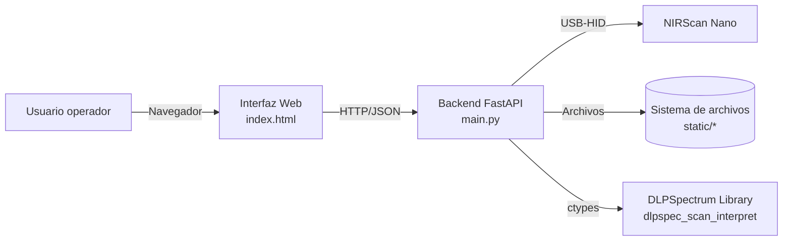
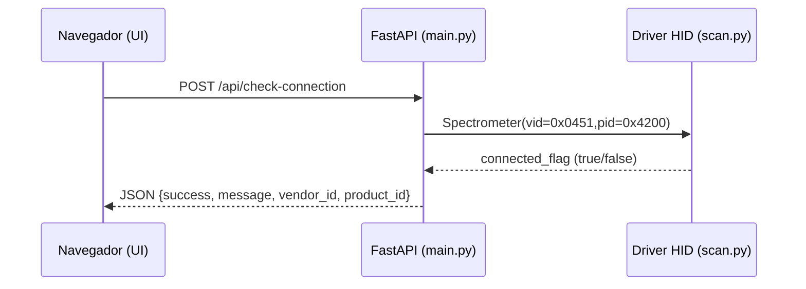
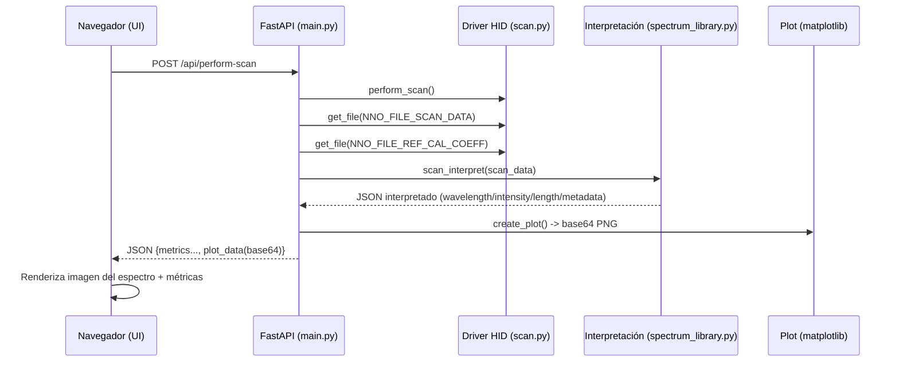
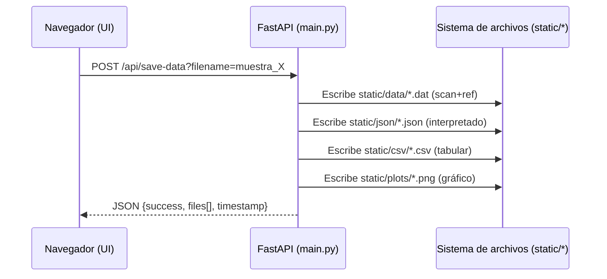

## Arquitectura de software — Prototipo SmartMilk (Interfaz Web + NIRScan Nano)

### Propósito y alcance
Este documento describe la arquitectura del software implementado en `NIRScan_Nano_Python-master/web_interface/`, correspondiente al prototipo **SmartMilk** para adquisición de espectros NIR con **NIRScan Nano**, visualización en web y guardado de resultados.

El alcance cubre:
- Interfaz web (HTML/JS) para operación por el usuario.
- Backend en Python (FastAPI) que orquesta el escaneo, procesado, visualización y persistencia.
- Capa de comunicación con el dispositivo por USB/HID.
- Interpretación de los datos crudos del escaneo usando una librería externa (DLPSpectrum / `dlpspec_*` vía `ctypes`).

---

### Vista general (resumen)
El sistema sigue una arquitectura **cliente-servidor** local:
- **Cliente (navegador)**: UI en `templates/index.html` que invoca endpoints REST (`/api/*`) y renderiza el gráfico del espectro.
- **Servidor (FastAPI + Uvicorn)**: implementado en `main.py`, expone endpoints para:
  - verificar conexión al sensor,
  - ejecutar un escaneo,
  - interpretar el espectro,
  - devolver un gráfico como imagen base64,
  - guardar resultados en múltiples formatos.
- **Driver/Acceso hardware**: `scan.py` usa `hid` (HIDAPI) + utilidades `usb.py` para enviar/recibir comandos del NIRScan Nano.
- **Interpretación de espectro**: `spectrum_library.py` usa `ctypes` para invocar `dlpspec_scan_interpret` y producir una estructura con `wavelength`, `intensity`, `length` y metadatos, serializada a JSON.
- **Persistencia**: archivos generados en `static/` (`.dat`, `.json`, `.csv`, `.png`).

---

### Tecnologías y dependencias
#### Backend
- **FastAPI**: API HTTP (endpoints `/api/*`) y entrega de la página HTML.
- **Uvicorn**: servidor ASGI.
- **matplotlib** (backend `Agg`): generación de gráficas sin UI (PNG y base64).
- **pandas / numpy**: construcción de CSV y utilidades numéricas.
- **hid (HIDAPI)**: comunicación con el dispositivo por USB-HID.

Dependencias declaradas en `web_interface/requirements.txt`:
- `fastapi`, `uvicorn[standard]`, `matplotlib`, `pandas`, `numpy`, `python-multipart`.

#### Frontend
- **HTML + CSS + JavaScript** embebidos (sin framework).
- `fetch()` para invocar el backend.

#### Librería externa de interpretación
En `spectrum_library.py` se invoca una librería nativa vía `ctypes`:
- `dlpspec_scan_interpret(...)` sobre un buffer de bytes del escaneo.

Nota: el archivo referencia una ruta de DLL en Windows:
`C:/ti/DLPSpectrumLibrary_2.0.3/src/dlpspec.dll`.
En otros sistemas operativos se requiere un equivalente (`.so`/`.dylib`) y ajuste del path.

---

### Estructura del proyecto (módulos relevantes)
```text
web_interface/
├── main.py                 Backend FastAPI (orquestación end-to-end)
├── templates/
│   └── index.html          UI (cliente web)
├── static/                 Persistencia de salidas (se crea automáticamente)
│   ├── data/               Archivos .dat (crudo combinado)
│   ├── json/               Resultado interpretado en JSON
│   ├── csv/                Espectro tabular (wavelength_nm, intensity)
│   └── plots/              Gráficos PNG
└── requirements.txt        Dependencias del backend

(en el directorio padre)
NIRScan_Nano_Python-master/
├── scan.py                 Driver/operación de escaneo (HID)
├── usb.py                  Construcción de comandos read/write (protocolo)
├── util.py                 Utilidad `shiftBytes` (tamaño/ensamble de bytes)
└── spectrum_library.py     Interpretación del buffer del escaneo vía ctypes
```

---

### Diagramas (C4 simplificado)
#### Diagrama de contexto (Sistema)


#### Diagrama de contenedores (despliegue local)
```mermaid
flowchart TB
  subgraph PC[PC/Laptop del operador]
    Browser[Navegador Web]
    Server[Uvicorn + FastAPI]
    Files[(static/<br/>data,json,csv,plots)]
  end
  Sensor[NIRScan Nano (USB)] -->|HID| Server
  Browser -->|HTTP :8000| Server
  Server --> Files
```

---

### Componentes y responsabilidades
#### 1) Cliente web (`templates/index.html`)
Responsabilidades principales:
- Mostrar el estado “conectado/desconectado” y habilitar/deshabilitar botones.
- Llamar endpoints:
  - `POST /api/check-connection`
  - `POST /api/perform-scan`
  - `POST /api/save-data?filename=...`
  - `GET /api/status` (estado inicial)
- Renderizar el espectro recibido como **imagen base64** en un ``.
- Mostrar métricas resumidas del escaneo (tiempo, longitud del espectro, rango, intensidad máxima).

Observación: existe un botón “Subir a Drive”, pero actualmente solo muestra un mensaje “en desarrollo” en el frontend; no hay endpoint backend implementado para esa función.

#### 2) API/Orquestación (`web_interface/main.py`)
Responsabilidades principales:
- Exponer endpoints REST y servir la UI.
- Mantener estado en memoria (prototipo) mediante variables globales:
  - `spectrometer`, `device_connected`, `scan_data`, `reference_data`, `interpreted_data`.
- Ejecutar el flujo:
  1) conectar al dispositivo (VID/PID),
  2) escanear,
  3) descargar buffers de archivos internos (`NNO_FILE_SCAN_DATA`, `NNO_FILE_REF_CAL_COEFF`),
  4) interpretar el buffer del escaneo,
  5) graficar y retornar la imagen como base64,
  6) guardar resultados en disco.

Endpoints (resumen):
- `GET /`: entrega `templates/index.html`.
- `GET /api/status`: devuelve flags de estado y timestamp.
- `POST /api/check-connection`: intenta abrir el NIRScan Nano con:
  - Vendor ID `0x0451`
  - Product ID `0x4200`
- `POST /api/perform-scan`: ejecuta escaneo y responde JSON con métricas + `plot_data` (base64).
- `POST /api/save-data?filename=...`: persiste `.dat`, `.json`, `.csv`, `.png` y devuelve lista de archivos generados.

Persistencia (convención de nombres):
- `safe_filename` (solo alfanuméricos, espacio, `-`, `_`) + `YYYYMMDD_HHMMSS`.

#### 3) Driver/Núcleo de adquisición (`scan.py`, `usb.py`, `util.py`)
Responsabilidades principales:
- `scan.py` define `Spectrometer`, que:
  - se conecta por HID (`hid.device().open(vid,pid)`),
  - ejecuta `perform_scan()` enviando comandos al dispositivo y esperando a que termine,
  - recupera archivos internos del dispositivo con `get_file(file_id)`.
- `usb.py` implementa `readCommand()` y `writeCommand()`:
  - construye tramas con bytes de control (flags, longitudes, command/group) y lee respuestas.
- `util.py` implementa `shiftBytes()` para componer tamaños/valores a partir de listas de bytes.

#### 4) Interpretación del espectro (`spectrum_library.py`)
Responsabilidades principales:
- Define estructuras `ctypes.Structure` (p. ej. `scanResults`) que modelan el resultado interpretado.
- Carga una librería nativa (`dlpspec.dll`) y ejecuta:
  - `dlpspec_scan_interpret(buffer, size, results_ptr)`
- “Desempaqueta” (unpack) la estructura y la serializa a JSON.

Salida lógica (campos esperados):
- `wavelength`: arreglo de longitudes de onda (nm).
- `intensity`: arreglo de intensidades.
- `length`: número de puntos válidos.
- Metadatos: fecha/hora, temperaturas, configuración de escaneo, etc.

---

### Flujos principales (secuencias)
#### Flujo A — Verificar conexión


#### Flujo B — Escaneo y visualización


#### Flujo C — Guardado de datos


---

### Modelo de datos y artefactos generados
#### Datos en memoria (prototipo)
- `scan_data`: lista de bytes leídos del sensor (`NNO_FILE_SCAN_DATA`).
- `reference_data`: lista de bytes de calibración (`NNO_FILE_REF_CAL_COEFF`).
- `interpreted_data`: diccionario (resultado de `scan_interpret`) con:
  - `wavelength[]`, `intensity[]`, `length`, y metadatos.

#### Archivos en disco (`static/`)
- **`.dat`**: combinación binaria `scan_data + reference_data`.
- **`.json`**: `interpreted_data` con `indent=2` y UTF-8.
- **`.csv`**: dos columnas `wavelength_nm` e `intensity` (recortadas por `length`).
- **`.png`**: figura de matplotlib con el espectro y timestamp.

---

### Despliegue y operación
#### Ejecución local
- Comando: `python main.py`
- Servidor: `uvicorn.run("main:app", host="0.0.0.0", port=8000, reload=True)`
- Acceso UI: `http://localhost:8000`

#### Dependencias externas (hardware/software)
- Sensor **NIRScan Nano** conectado por USB.
- Librería nativa para `dlpspec_scan_interpret` disponible en el sistema (actualmente referenciada como DLL de Windows).

---

### Consideraciones de diseño (atributos de calidad)
#### Fortalezas (adecuadas para prototipo)
- **Ciclo rápido**: UI simple + API simple, fácil de operar y demostrar.
- **Trazabilidad de salida**: se guardan múltiples formatos útiles para análisis e informe.
- **Separación lógica**: UI (cliente), orquestación (API), driver (HID), interpretación (ctypes).

#### Limitaciones actuales (importantes en un informe)
- **Estado global en `main.py`**: el sistema asume un flujo secuencial y un único usuario; con múltiples usuarios/peticiones concurrentes puede mezclar estados.
- **CORS abierto** (`allow_origins=["*"]`): conveniente para prototipo, no recomendado para despliegues reales.
- **Exposición de red** (`host="0.0.0.0"`): permite acceso desde otras máquinas si hay red; para uso local puede restringirse a `127.0.0.1`.
- **Portabilidad**: `spectrum_library.py` apunta a una DLL de Windows; requiere adaptación para macOS/Linux (ruta + formato de librería).
- **Observabilidad**: se usan `print()`/logging parcial; para producción conviene logging estructurado.

---

### Puntos de extensión (siguientes pasos típicos)
- **Subida a Drive**: implementar endpoint backend (p. ej. `POST /api/upload-drive`) y manejo de credenciales; actualmente es un placeholder UI.
- **Persistencia enriquecida**: guardar metadatos de la muestra (operador, lote, temperatura ambiente, etc.) y un índice/BD.
- **Predicción SmartMilk**: incorporar modelos (p. ej. clasificación/regresión) usando el espectro (desde JSON/CSV) y exponer resultados en la UI.
- **Arquitectura multiusuario**: reemplazar variables globales por sesiones/IDs de trabajo o almacenamiento temporal por request.

---

### Mapeo rápido “archivo → responsabilidad”
- `web_interface/main.py`: API + orquestación + generación de gráficos + guardado.
- `web_interface/templates/index.html`: UI web (operación y visualización).
- `scan.py`: abstracción del espectrómetro y comandos de escaneo/lectura.
- `usb.py`: protocolo/paquetes de lectura-escritura HID.
- `spectrum_library.py`: interpretación del buffer del escaneo (ctypes + librería nativa).
- `static/*`: repositorio de artefactos generados por el prototipo.

